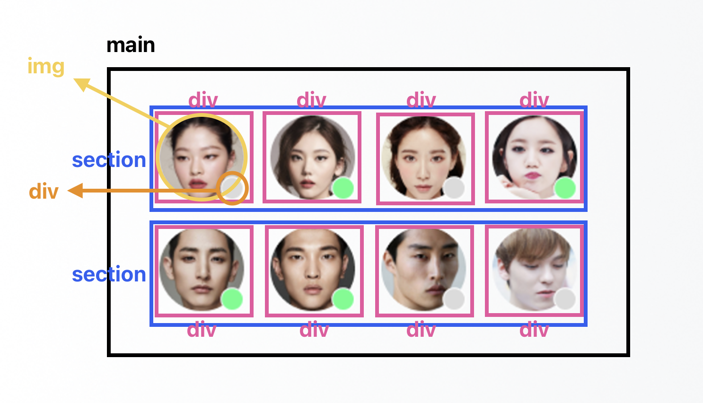

# 240503 과제

- html 구조 설계
- float, flex 활용하여 css 구현

<br/>

## :pushpin: 마크업 구조


- 전체 요소를 `main`으로 묶어주었습니다.
- 여자 이미지만 모인 영역과 남자 이미지만 모인 영역을 2개의 `section`으로 나누었습니다.
- 이미지를 `img` 요소로, 상태를 나타내는 원 도형을 `div`로 마크업하였고, 이미지와 원 도형을 하나로 묶기 위해 `div`로 마크업하였습니다.

##  :pushpin: float 사용

### :pencil2: main 영역
```css
.main {
  display: flow-root;
  position: absolute;
  left: 50%;
  top: 50%;
  transform: translate(-50%, -50%);
}
```

- `display: flow-root`를 지정하여 main이 float 속성을 주는 요소들의 __부모__ 임을 지정해주었습니다.
- main의 부모 요소인 body를 기준으로 위치를 지정하기 위해 `absolute` 속성으로 `position`을 선언했습니다.
- `left`, `top`을 각각 50%씩 지정하여 main 요소의 왼쪽 꼭지점을 화면의 가운데 배치하였습니다.
- `transform`는 주어진 x, y축 값만큼 이동하는 속성입니다. main 요소 크기의 50%만큼 x축과 y축이 모두 반대로(음수) 이동함으로써 main 요소가 화면의 정중앙에 배치되었습니다.

<br/>

### :pencil2: img 영역

```css
.avartar_img {
  width: 64px;
  height: 64px;
  border-radius: 50%;
}
```
- 이미지 크기를 가로 세로 모두 64px로 지정하고 `border-radius`를 50%로 주어 동그란 모양을 만들었습니다.

<br/>

### :pencil2: 이미지와 원 도형을 포함하는 div 영역

```css
.woman {
  float: left;
  position: relative;
}

.woman:nth-child(n+2){
  margin-left: 20px;
}
```
- 이미지와 원 도형을 포함하는 div 요소에 `float: left;`로 좌측 정렬을 주었습니다.
- 이미지와 원 도형을 포함하는 div 요소에 `position: relative;` 를 주어 img와 div() 요소들이 div(이미지+원형)를 부모로 삼아 위치할 수 있도록 합니다.
- `nth-child()` 선택자를 활용하여 2~4번째 이미지 앞에 간격을 줍니다.
- man 섹션 내부의 div도 동일한 스타일을 사용합니다.

<br/>

### :pencil2: 원 도형 div 영역

```css
.on {
  position: absolute;
  background-color: #4CFE88;
  width: 20px;
  height: 20px;
  border: 0.5px solid white;
  border-radius: 100%;
  margin-left: 70%;
  margin-top: -40%;
}
```
- `position: absolute;`로 가장 가까운 부모 요소(woman)를 기준으로 위치를 이동할 수 있게 지정하였습니다.
- 원의 크기와 border-radius를 지정하여 동그란 모양으로 만들어 주었습니다.
- `margin-left` , `margin-top` 속성을 사용하여 이미지 오른쪽 하단에 원 도형이 위치할 수 있도록 대략적으로 지정하였습니다.
- off를 나타내는 원 도형도 동일한 스타일을 사용합니다.

<br/>

## :pushpin: flex 사용

### :pencil2: @supports

```css
@supports (display: flex) {
  ~~
}
```
- `flex`를 지원하는 브라우저 환경일 때, 해당 스타일을 적용해줄 수 있는 at-rule을 선언해주었습니다.

### :pencil2: main 영역

```css
 .main {
    height: 100vh;
    display: flex;
    flex-flow: column wrap;
    justify-content: center;
    align-items: center;
  }
```
- `align-items`으로 중앙 정렬을 주기 위해 `height`를 100vh로 주어 viewport 높이의 100%를 사용하였습니다. (viewport가 달라지더라도 동일하게 중앙 정렬될 수 있도록 하였습니다.)
- `display: flex;`로 main 내부의 section 요소들이 flex 항목이 될 수 있도록 선언해줍니다.
- `flex-flow: column wrap;`로 section 요소들이 세로(column)로 줄바꿈(wrap)되어 배치되도록 선언해주었습니다.
- `justify-content: center;` 속성으로 section 요소들이 중앙에 배치될 수 있도록 지정해주었습니다.

### :pencil2: section (woman)

```css
.woman_list {
      display: flex;
      flex-flow: row nowrap;
      justify-content: center;
  }

  .woman:nth-child(n+2){
    margin-left: 20px;
  }
```
- section 내부 요소들을 flex 항목으로 배치할 수 있도록 display: flex;를 선언합니다.
- flex-flow: row wrap;을 선언하여 section 내부의 div 요소들이 가로(row)로 줄바꿈 되지 않도록(nowrap) 지정해줍니다.
- justify-content: center;로 중앙 정렬되도록 배치합니다.
- `nth-child()` 선택자를 활용하여 2~4번째 이미지 앞에 간격을 줍니다.

<br/>

### :pencil2: section (man)

```css
.man_list {
    display: flex;
    flex-flow: row nowrap;
    justify-content: center;
    order: -1;
  }

  .man:nth-child(n+2) {
    margin-left: 20px;
  }
```
- woman 섹션과 모두 동일한 스타일을 사용합니다.
- 다른점은, woman과 man의 위치를 바꾸기 위해 `order: -1;`을 주어 man이 먼저 노출되도록 지정해주었습니다.

<br/>

### :pencil2: 원 도형 div 영역

```css
  .on {
    position: relative;
    background-color: #4CFE88;
    width: 20px;
    height: 20px;
    border: 0.5px solid white;
    border-radius: 100%;
    margin-left: 70%;
    margin-top: -40%;
  }
```
- `position: relative;`로 원래의 위치를 기준으로 배치될 수 있도록 하였습니다. 
- 원의 크기와 border-radius를 지정하여 동그란 모양으로 만들어 주었습니다.
- `margin-left` , `margin-top` 속성을 사용하여 이미지 오른쪽 하단에 원 도형이 위치할 수 있도록 대략적으로 지정하였습니다.
- off를 나타내는 원 도형도 동일한 스타일을 사용합니다.

<br/>

## :pushpin: 느낀 점

### :speech_balloon: 마크업

웹 접근성을 높이기 위해 aria-label을 활용하였고, main과 같은 시맨틱 태그나 img 같이 대체 텍스트를 입력할 수 있는 태그의 경우에는 별도의 라벨을 붙이지 않았습니다. 이렇게 접근성을 고려하여 구조를 고민하고 설계하는 일련의 과정들이 반복되어 습관화될 수 있도록 노력하려고 합니다. 이런 과정이 습관화된다면 현업에 가서도 좋은 코드를 구현하는 개발자가 될 수 있을 것 같습니다. 

### :speech_balloon: CSS

float를 활용하는게 생각보다 너무 어려웠습니다. 특히 postion의 relative와 absolute 옵션을 적절히 섞어 쓰는게 많이 헷갈렸습니다. 지금도 반만 이해한 상태로 구현한 것 같은데 좀 더 다양한 예제와 많은 연습이 필요해보입니다.

### :speech_balloon: 설계하면서..

at사인을 사용하여 브라우저 지원 여부에 따라 어떤 스타일을 적용할 지 정할 수 있도록 구현해보니 개발자 특히 프론트엔드 개발자는 여러가지 환경을 다 대비하면서 코드를 설계해야하는구나라는 생각이 들었습니다. 제가 QA로 일하면서 여러 브라우저를 비교할때마다 이 브라우저에서는 되는데 저 브라우저에서는 안될까 하면서 이슈로 등록했던 것들이 이런게 고려되지 않고 개발되었기 때문일 수도 있었겠다는 생각이 들었습니다.

<br/>

## :pushpin: 아쉬운 점

### :droplet: div 태그

사진 요소인 img와 원 도형 요소인 div를 감싸는 태그를 어떤 태그로 사용해야할까 고민했는데 결국 div로 감쌌습니다... iframe을 사용하니 이미지가 사라지고 figure를 사용하려니 user agent stylesheet로 배치가 망가져 그냥 div를 사용하게 됩니다. 왜 현업에서 div 파티가 열리는지 느낄 수 있었습니다..

### :droplet: flex-flow 속성

flex를 활용할 때 flex-flow의 속성값 중 wrap/no wrap 속성 어떤것을 선언하든 원하는 모양으로 배치가 되고 있어서 조금 당황스러웠습니다. 원하는 속성이 어떤 것인지 명시하는 차원에서 일단 속성값을 선언해주었습니다. 다만 상반되는 두 개의 속성을 주어도 바뀌지 않는 모양을 보면서 잘못 구현한 것인가.. 하는 생각이 계속해서 들었습니다. :cry: 

### :droplet: section 사이 간격

woman 섹션과 man 섹션 사이의 간격을 주고 싶어서 이것 저것 활용해보고 있는데 도저히 구현이 안되네요. :sob: 과제 제출 시간이 되어 현재 여기까지는 구현하지 못하고 제출하고, 계속 이어서 구현을 시도해볼 예정입니다.

### :droplet: 접근성 label

flex를 활용한 코드에서는 man 섹션이 먼저 나오고 다음에 woman 섹션이 나오도록 구현했지만 웹 개발자도구에서 접근성 트리를 켜보니 woman 섹션의 label이 먼저 나오고 있습니다. 이 부분도 아직 수정하지 못하였고 과제 제출 이후에 이어서 시도해볼 예정입니다.
(똑같은 질문이 질의응답방에 올라왔네요!!:sob::sob:)

<br/>

## :pushpin: 총평

### HTML/CSS 공부하자.. !!!! :smiling_imp::smiling_imp:

